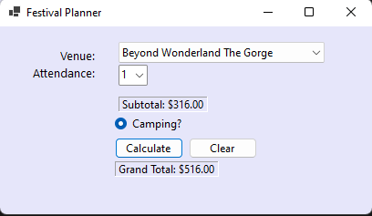

# Festival Planner
A C# Windows Form application designed to calculate festival revenue, 
featuring attendance selection, camping surcharges, and real-time 
calculation.

## Features
- Dynamic venue selection.
- Real-time revenue subtotal and grand total updates.
- Camping surcharge toggle.
- Robust input validation.

## Screenshot

